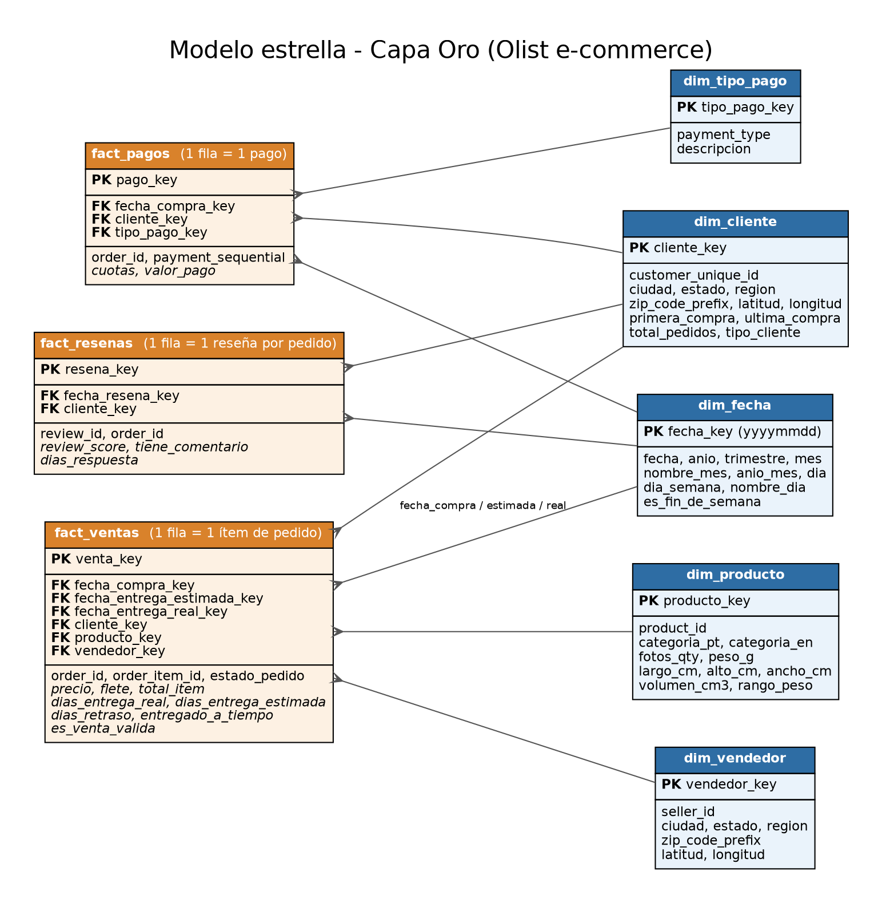

# 🛒 Pipeline de Datos con Arquitectura Medallón – E-commerce Olist


**Proyecto final – SQL for Data Engineer**

Pipeline de datos construido 100 % con **SQL (T-SQL / SQL Server)** que ingiere los archivos CSV del
dataset público [*Brazilian E-Commerce Public Dataset by Olist*](https://www.kaggle.com/datasets/olistbr/brazilian-ecommerce)
(≈100 mil pedidos entre 2016 y 2018) y los transforma, capa por capa, en un **modelo estrella** listo
para conectarse a un dashboard de BI.

---

## 📌 Tabla de contenidos
1. [El dataset](#-el-dataset)
2. [Arquitectura](#-arquitectura)
3. [Modelo de datos final](#-modelo-de-datos-final-capa-oro)
4. [Reglas de calidad y de negocio](#-reglas-de-calidad-y-de-negocio)
5. [Estructura del repositorio](#-estructura-del-repositorio)
6. [Cómo ejecutarlo](#-cómo-ejecutarlo)
7. [Validación de resultados](#-validación-de-resultados)
8. [Ejemplos de análisis](#-ejemplos-de-análisis)
9. [Solución de problemas](#-solución-de-problemas)
10. [Mejoras futuras y créditos](#-mejoras-futuras-y-créditos)

---

## 📦 El dataset

El proyecto usa el [**Brazilian E-Commerce Public Dataset by Olist**](https://www.kaggle.com/datasets/olistbr/brazilian-ecommerce),
publicado en Kaggle. Olist es una plataforma brasileña que conecta a pequeños comercios con los principales
marketplaces del país. El dataset reúne información real y anonimizada de **unos 100 mil pedidos realizados
entre septiembre de 2016 y octubre de 2018**, y permite analizar cada pedido desde varias perspectivas: estado
y tiempos de entrega, precio y flete, medio de pago, ubicación de clientes y vendedores, características del
producto y opiniones de los clientes.

Se distribuye como **9 archivos CSV relacionales** (un pedido puede tener varios ítems, varios pagos y una o más reseñas):

| Archivo CSV | Contenido | Filas |
|---|---|---|
| `olist_orders_dataset.csv` | Pedidos: estado y fechas de compra, aprobación, envío, entrega y entrega estimada | 99,441 |
| `olist_order_items_dataset.csv` | Ítems de cada pedido: producto, vendedor, precio y flete | 112,650 |
| `olist_order_payments_dataset.csv` | Pagos de cada pedido: medio de pago, cuotas y valor | 103,886 |
| `olist_order_reviews_dataset.csv` | Reseñas: puntaje de 1 a 5, comentario y fechas | 99,224 |
| `olist_customers_dataset.csv` | Clientes: identificador por pedido, identificador único, ciudad, estado y código postal | 99,441 |
| `olist_sellers_dataset.csv` | Vendedores: ciudad, estado y código postal | 3,095 |
| `olist_products_dataset.csv` | Productos: categoría, peso, dimensiones y número de fotos | 32,951 |
| `olist_geolocation_dataset.csv` | Coordenadas (latitud y longitud) por prefijo de código postal | 1,000,163 |
| `product_category_name_translation.csv` | Traducción de las categorías de portugués a inglés | 71 |

Es un dataset adecuado para este proyecto porque, al ser datos reales, trae los problemas típicos que
justifican una arquitectura por capas: filas duplicadas, valores nulos, categorías sin traducción, textos con
acentos y coordenadas fuera de rango (ver [Reglas de calidad](#-reglas-de-calidad-y-de-negocio)).

> Los CSV **no se incluyen en este repositorio** por su tamaño (≈120 MB). Descárgalos desde Kaggle y colócalos en `data/raw/`.

---

## 🏗 Arquitectura

```
  CSV (9 archivos)          BRONCE                PLATA                     ORO
┌────────────────┐     ┌──────────────┐     ┌────────────────┐     ┌─────────────────────┐
│ olist_*.csv    │ ──► │ copia cruda  │ ──► │ sin duplicados │ ──► │ modelo estrella     │ ──► Dashboard
│ (fuente)       │BULK │ + fecha_carga│ SQL │ nulos tratados │ SQL │ hechos + dimensiones│
└────────────────┘     └──────────────┘     │ tipos correctos│     │ reglas de negocio   │
                                            └────────────────┘     └─────────────────────┘
```

| Capa | Esquema | Responsabilidad | Objetos |
|---|---|---|---|
| **Bronce** | `bronze` | Extrae de los CSV y guarda **sin modificar** (todo como texto). Agrega `fecha_carga` (fecha y hora) y `archivo_origen`. | 9 tablas + `usp_load_bronze` |
| **Plata** | `silver` | Lee de Bronce. Elimina duplicados, gestiona nulos, estandariza tipos (fechas → `DATE`/`DATETIME2`, montos → `FLOAT`, cantidades → `INT`) y normaliza texto. | 9 tablas + `usp_load_silver` |
| **Oro** | `gold` | Lee de Plata. Crea el **modelo estrella** con reglas de negocio y métricas. | 5 dimensiones, 3 hechos, 6 vistas + `usp_load_gold` |

Cada capa se carga con un **procedimiento almacenado** reejecutable (carga completa / *full refresh*),
con manejo de errores (`TRY/CATCH`) y mensajes de avance.

---

## ⭐ Modelo de datos final (capa Oro)



> Fuente editable: [`docs/modelo_estrella.dot`](docs/modelo_estrella.dot) · versión Mermaid: [`docs/modelo_estrella.md`](docs/modelo_estrella.md)

| Tabla | Tipo | Granularidad | Filas |
|---|---|---|---|
| `fact_ventas` | Hecho | 1 fila por ítem de pedido | 112,650 |
| `fact_pagos` | Hecho | 1 fila por pago | 103,886 |
| `fact_resenas` | Hecho | 1 reseña por pedido | 98,673 |
| `dim_fecha` | Dimensión | 1 fila por día (2016-2018) | 1,096 |
| `dim_cliente` | Dimensión | 1 fila por cliente único | 96,096 |
| `dim_producto` | Dimensión | 1 fila por producto | 32,951 |
| `dim_vendedor` | Dimensión | 1 fila por vendedor | 3,095 |
| `dim_tipo_pago` | Dimensión | 1 fila por medio de pago | 5 |

**Decisiones de diseño**
- **Dos hechos con distinta granularidad** (ventas y pagos): unir los pagos al ítem duplicaría los ingresos, porque un pedido puede tener varios pagos.
- **`dim_cliente` a nivel de `customer_unique_id`**: en Olist el `customer_id` cambia en cada pedido; usar el ID único permite identificar clientes recurrentes (2,997 compraron más de una vez).
- **`dim_fecha` como dimensión *role-playing*** en `fact_ventas`: fecha de compra, fecha estimada y fecha real de entrega.
- **Llaves sustitutas** enteras (`*_key`) en todas las dimensiones y llaves foráneas declaradas en los hechos.

---

## 🧹 Reglas de calidad y de negocio

### Plata – problemas encontrados en los datos y su tratamiento
| Hallazgo en Bronce | Tratamiento en Plata |
|---|---|
| `geolocation`: 261,831 filas duplicadas exactas (26 %) y 42 coordenadas fuera de Brasil | Deduplicación con `GROUP BY` + filtro de coordenadas |
| `order_reviews`: 814 `review_id` repetidos y 551 pedidos con más de una reseña | Llave `(review_id, order_id)`; se conserva la respuesta más reciente |
| `order_reviews`: 87,656 títulos y 58,247 mensajes nulos | `'Sin título'` / `'Sin comentario'` + columna `tiene_comentario` |
| `products`: 610 productos sin categoría, nombre, descripción ni fotos | `'sin_categoria'` y `0`; peso/dimensiones nulos (2 filas) se mantienen `NULL` |
| `product_category_translation`: faltan 2 categorías que sí usa `products` | Se agregan `pc_gamer` y `portateis_cozinha_e_preparadores_de_alimentos` (+ `sin_categoria`) |
| `orders`: 160 sin aprobación, 1,783 sin transportista, 2,965 sin entrega | Se dejan en `NULL`: son nulos **legítimos** (pedidos cancelados o en tránsito) |
| Nombre de columna mal escrito (`product_name_lenght`) | Se corrige a `product_name_length` |
| Códigos postales sin ceros a la izquierda, ciudades con acentos/mayúsculas | `CHAR(5)` con relleno; ciudades en minúscula y sin acentos |

### Oro – métricas y reglas de negocio
| Campo | Definición |
|---|---|
| `es_venta_valida` | 0 si el pedido está `canceled` o `unavailable`; los ingresos siempre filtran `= 1` |
| `total_item` | `precio + flete` |
| `dias_entrega_real` | Días entre la compra y la entrega al cliente |
| `dias_retraso` | Días de atraso frente a la fecha estimada (0 si llegó a tiempo; `NULL` si no se entregó) |
| `entregado_a_tiempo` | 1 si la entrega ocurrió en o antes de la fecha estimada |
| `tipo_cliente` | `Recurrente` si tiene 2 o más pedidos, si no `Nuevo` |
| `region` | Región de Brasil derivada del estado (Norte, Nordeste, Centro-Oeste, Sudeste, Sur) |
| `rango_peso` | Ligero (< 500 g), Medio (500 g – 2 kg), Pesado (> 2 kg) |
| `volumen_cm3` | largo × alto × ancho |

**Vistas listas para el dashboard:** `vw_ventas_mensuales`, `vw_top_categorias`, `vw_top_vendedores`,
`vw_entregas_por_estado`, `vw_metodos_pago`, `vw_satisfaccion_mensual`.

---

## 📁 Estructura del repositorio

```
olist-medallion-sql/
├── README.md
├── .gitignore
├── data/raw/                        ← aquí van los 9 CSV (no se suben a GitHub)
├── docs/
│   ├── modelo_estrella.png / .svg / .dot
│   └── modelo_estrella.md           (diagrama Mermaid)
└── sql/
    ├── 00_init_database.sql         crea la BD OlistDW y los esquemas
    ├── bronze/
    │   ├── 01_ddl_bronze.sql        tablas crudas + fecha_carga
    │   └── 02_proc_load_bronze.sql  extracción CSV → Bronce (BULK INSERT)
    ├── silver/
    │   ├── 03_ddl_silver.sql        tablas tipadas y con llaves
    │   └── 04_proc_load_silver.sql  limpieza Bronce → Plata
    ├── gold/
    │   ├── 05_ddl_gold.sql          modelo estrella (dimensiones y hechos)
    │   ├── 06_proc_load_gold.sql    transformación Plata → Oro
    │   └── 07_views_bi.sql          vistas de KPIs para el dashboard
    ├── run_pipeline.sql             ejecuta Bronce → Plata → Oro
    └── 99_validaciones.sql          conteos, duplicados, nulos y conciliación de montos
```

---

## ▶️ Cómo ejecutarlo

**Requisitos:** SQL Server 2017 o superior (Express/Developer o Docker) y Visual Studio Code con la
extensión **SQL Server (mssql)** de Microsoft.

1. **Clona el repositorio** y descarga el dataset desde [Kaggle](https://www.kaggle.com/datasets/olistbr/brazilian-ecommerce).
2. **Copia los 9 archivos `.csv` en una carpeta que SQL Server pueda leer**, por ejemplo `C:\olist\raw\`.
   (Evita carpetas de usuario como `Documents` o `Desktop`: el servicio de SQL Server normalmente no tiene permiso).
3. En VS Code, crea una conexión a tu servidor (`localhost`) y ejecuta con `Ctrl+Shift+E`, **en este orden**:

   | Paso | Script |
   |---|---|
   | 1 | `sql/00_init_database.sql` |
   | 2 | `sql/bronze/01_ddl_bronze.sql` → `02_proc_load_bronze.sql` |
   | 3 | `sql/silver/03_ddl_silver.sql` → `04_proc_load_silver.sql` |
   | 4 | `sql/gold/05_ddl_gold.sql` → `06_proc_load_gold.sql` → `07_views_bi.sql` |

4. **Ejecuta el pipeline** (ajusta la ruta a tu carpeta de CSV):

   ```sql
   USE OlistDW;
   EXEC bronze.usp_load_bronze @ruta_base = N'C:\olist\raw\';
   EXEC silver.usp_load_silver;
   EXEC gold.usp_load_gold;
   ```

5. **Valida** ejecutando `sql/99_validaciones.sql`.

> Si usas SQL Server en Docker, monta la carpeta de los CSV dentro del contenedor
> (por ejemplo `-v "$(pwd)/data/raw:/var/opt/mssql/raw"`) y usa `@ruta_base = N'/var/opt/mssql/raw/'`.

---

## ✅ Validación de resultados

`sql/99_validaciones.sql` comprueba conteos por capa, ausencia de duplicados, tratamiento de nulos y
**conciliación de montos** entre capas (no se pierde ni se duplica dinero).

| Control | Resultado esperado |
|---|---|
| Filas en Bronce = filas de los CSV | customers 99,441 · geolocation 1,000,163 · order_items 112,650 · payments 103,886 · reviews 99,224 · orders 99,441 · products 32,951 · sellers 3,095 |
| `silver.geolocation` (sin duplicados ni puntos fuera de Brasil) | 720,463 |
| Suma de `price`: Bronce = Plata = `fact_ventas` | 13,591,643.70 |
| Suma de pagos: Bronce = Plata = `fact_pagos` | 16,008,872.12 |
| Ingresos válidos (sin cancelados ni no disponibles) | 13,494,400.74 en 98,199 pedidos |
| Entregas a tiempo | ≈ 93 % |

---

## 📊 Ejemplos de análisis

```sql
-- Top 10 categorías por ingresos
SELECT TOP 10 categoria, unidades, ingresos, ranking
FROM gold.vw_top_categorias
ORDER BY ranking;

-- Evolución mensual de ventas
SELECT anio_mes, pedidos, ingresos, ticket_promedio
FROM gold.vw_ventas_mensuales
ORDER BY anio, mes;

-- Estados con más retraso en entregas
SELECT TOP 5 estado, pedidos_entregados, dias_entrega_promedio, pct_entregas_a_tiempo
FROM gold.vw_entregas_por_estado
ORDER BY pct_entregas_a_tiempo ASC;

-- Clientes recurrentes por región
SELECT region, tipo_cliente, COUNT(*) AS clientes
FROM gold.dim_cliente
GROUP BY region, tipo_cliente
ORDER BY region, tipo_cliente;
```

---

## 🛠 Solución de problemas

| Síntoma | Causa y solución |
|---|---|
| `Cannot bulk load. The file ... does not exist or you don't have file access rights` (error 4860) | La ruta no es correcta o SQL Server no puede leerla. Mueve los CSV a una carpeta como `C:\olist\raw\` y actualiza `@ruta_base`. |
| Plata muestra `0 filas` | Bronce está vacía. Ejecuta primero `EXEC bronze.usp_load_bronze ...`. |
| La salida de Plata parece detenida en `CARGA CAPA PLATA` | Es normal: la limpieza de geolocalización procesa 1 millón de filas y VS Code muestra los mensajes con retraso. Espera 1–2 minutos. |
| Error al usar `FORMAT = 'CSV'` o `STRING_AGG` | Se requiere SQL Server 2017 o superior. |

---

## 🚀 Mejoras futuras y créditos

- Carga incremental (hoy es *full refresh* en cada ejecución).
- Tabla de *logs* de ejecución y orquestación con SQL Server Agent o Airflow.
- `DECIMAL(12,2)` para los montos en un entorno productivo (aquí `FLOAT` por lineamiento del proyecto).
- Conectar un dashboard (Power BI / Tableau / Looker Studio) a las vistas de la capa Oro.

**Dataset:** [Olist – Brazilian E-Commerce Public Dataset](https://www.kaggle.com/datasets/olistbr/brazilian-ecommerce) (Kaggle).

**Autor:** _[Tu nombre]_ · Proyecto final del curso *SQL for Data Engineer* · [LinkedIn / GitHub]

