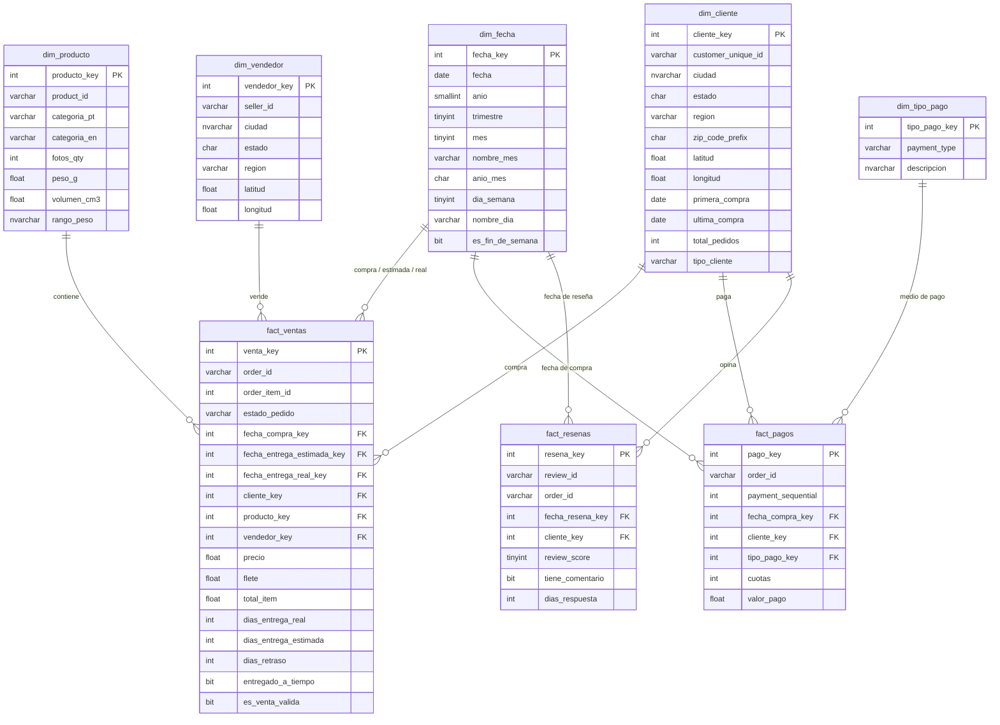

# Modelo de datos – Capa Oro (estrella)

Versión Mermaid (GitHub la renderiza automáticamente). La imagen completa está en
[`modelo_estrella.png`](modelo_estrella.png).

```mermaid
erDiagram
    dim_fecha    ||--o{ fact_ventas  : "compra / estimada / real"
    dim_cliente  ||--o{ fact_ventas  : compra
    dim_producto ||--o{ fact_ventas  : contiene
    dim_vendedor ||--o{ fact_ventas  : vende

    dim_fecha     ||--o{ fact_pagos  : "fecha de compra"
    dim_cliente   ||--o{ fact_pagos  : paga
    dim_tipo_pago ||--o{ fact_pagos  : "medio de pago"

    dim_fecha    ||--o{ fact_resenas : "fecha de reseña"
    dim_cliente  ||--o{ fact_resenas : opina

    fact_ventas {
        int venta_key PK
        varchar order_id
        int order_item_id
        varchar estado_pedido
        int fecha_compra_key FK
        int fecha_entrega_estimada_key FK
        int fecha_entrega_real_key FK
        int cliente_key FK
        int producto_key FK
        int vendedor_key FK
        float precio
        float flete
        float total_item
        int dias_entrega_real
        int dias_entrega_estimada
        int dias_retraso
        bit entregado_a_tiempo
        bit es_venta_valida
    }
    fact_pagos {
        int pago_key PK
        varchar order_id
        int payment_sequential
        int fecha_compra_key FK
        int cliente_key FK
        int tipo_pago_key FK
        int cuotas
        float valor_pago
    }
    fact_resenas {
        int resena_key PK
        varchar review_id
        varchar order_id
        int fecha_resena_key FK
        int cliente_key FK
        tinyint review_score
        bit tiene_comentario
        int dias_respuesta
    }
    dim_fecha {
        int fecha_key PK
        date fecha
        smallint anio
        tinyint trimestre
        tinyint mes
        varchar nombre_mes
        char anio_mes
        tinyint dia_semana
        varchar nombre_dia
        bit es_fin_de_semana
    }
    dim_cliente {
        int cliente_key PK
        varchar customer_unique_id
        nvarchar ciudad
        char estado
        varchar region
        char zip_code_prefix
        float latitud
        float longitud
        date primera_compra
        date ultima_compra
        int total_pedidos
        varchar tipo_cliente
    }
    dim_producto {
        int producto_key PK
        varchar product_id
        varchar categoria_pt
        varchar categoria_en
        int fotos_qty
        float peso_g
        float volumen_cm3
        nvarchar rango_peso
    }
    dim_vendedor {
        int vendedor_key PK
        varchar seller_id
        nvarchar ciudad
        char estado
        varchar region
        float latitud
        float longitud
    }
    dim_tipo_pago {
        int tipo_pago_key PK
        varchar payment_type
        nvarchar descripcion
    }
```
